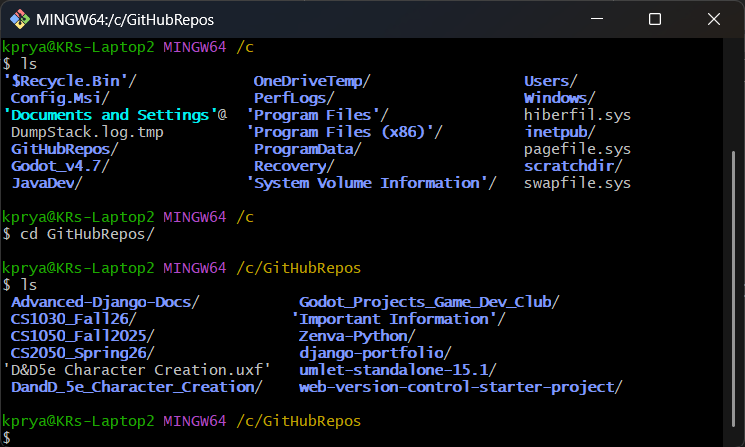
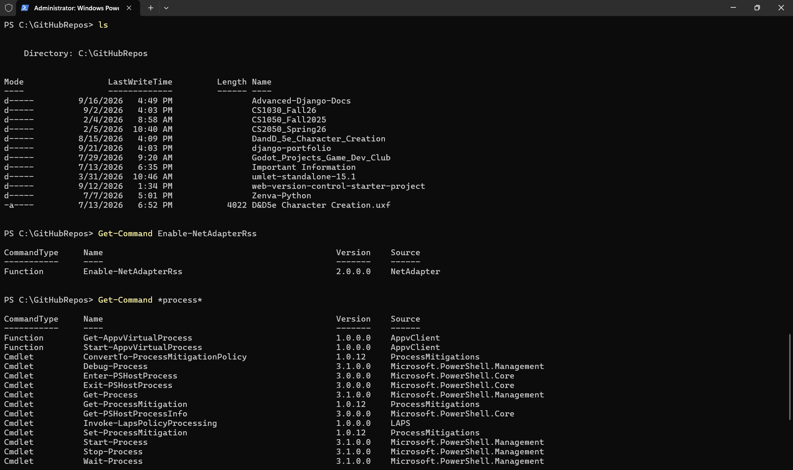

# Command Line

## What is it?

It is an interface that allows a user to interact with a computer's operating system. Allows users to execute commands by typing

### Commonly used for tasks

- File management
- System configuration
- Running scripts
- Executing git commands

## The two common command-line interfaces

### Git Bash

- Simple
- Uses Unix commands
- Downloaded from webpage
- Can use Git-specific commands

### PowerShell

- Uses named commands called cmdlets
- Passes objects between commands; some Unix-style names are aliases, not identical Unix commands
- Integrated with Windows, otherwise must be downloaded to device
- Can use git specific commands

### Unix Commands

There are many Unix commands but the main commands that we will use in this course are

| Command                  | Command Name                                 | Description                                                                                                                                                                                                                                                                   |
| ------------------------ | -------------------------------------------- | ----------------------------------------------------------------------------------------------------------------------------------------------------------------------------------------------------------------------------------------------------------------------------- |
| cd                       | Changed Directory(folder)                    | moves to a specified folder, can in the current folder, can move to folder above in the path using "cd .."  Ex: cd .. – move to folder above current folder  cd /c/GitHubRepos/CS1030Fall26/Resources                                                          |
| touch                    | Create Blank File                            | Create a blank file, when creating you follow touch with the filename.filetype  Ex: touch index.html                                                                                                                                                                    |
| ls                       | List Contents                                | Displays a list of all files and folders inside of a folder that are not hidden                                                                                                                                                                                               |
| mkdir                    | Make Directory                               | Create and name a folder in the current folder  Ex: mkdir Example_Folder                                                                                                                                                                                                |
| rm                       | remove                                       | Deletes a file.  Warning: File will be deleted with no system check to make sure you are deleting the correct file. Only use when ABSOULTLY SURE that you are deleting the correct file. Permanently deletes a file items are not moved to recycle bin or trash can.       |
| rmdir                    | Remove Directory                             | Deletes a folder  Warning: Folder will be deleted with no system check to make sure you are deleting the correct file. Only use when ABSOULTLY SURE that you are deleting the correct file. Permanently deletes a file items are not moved to recycle bin or trash can. |
| pwd                      | Display Directory Path                       | Displays the complete path for the current directory  EX. c:\\GitHubRepos\\CS1030\\Resources                                                                                                                                                                            |
| code(Windows) /open(mac) | Open in default programs (VSCode / VSCodium) | Opens a folder or file in the default program. In windows code is used instead of open. Will open current folder when followed by "."  Ex: code . – Current folder  open index.html – opens index file                                                               |
| cp A B                   | Copy File                                    | Copy a file from one folder to another folder                                                                                                                                                                                                                                 |
| mv A B                   | Move File                                    | Move file from one folder to another the folder. The folders paths must be listed when used.                                                                                                                                                                                  |

### Resources

| Resource Name                                          | Link                                                                                        |
| ------------------------------------------------------ | ------------------------------------------------------------------------------------------- |
| "Unix Commands Cheat Sheet: All the Commands You Need" | <https://www.stationx.net/unix-commands-cheat-sheet/>                                       |
| "35+ PowerShell Commands You Must Know"                | <https://lazyadmin.nl/powershell/powershell-commands/>                                      |
| "Git – git Documentation"                              | [https://git-scm.com/docs/git#\_git_commands](https://git-scm.com/docs/git%23_git_commands) |
## Navigation and file practice

Additional guidance by **ISA SAMIEZADE-YAZD**. A terminal is the window; a shell such as PowerShell or Bash interprets commands. Git must be installed separately to use Git commands in either shell.

| Task | PowerShell | Bash on macOS Linux or Git Bash |
| --- | --- | --- |
| Current directory | `Get-Location` | `pwd` |
| List including hidden files | `Get-ChildItem -Force` | `ls -a` |
| Enter a folder | `Set-Location "practice"` | `cd "practice"` |
| Parent folder | `Set-Location ..` | `cd ..` |
| Create directory | `New-Item -ItemType Directory practice` | `mkdir practice` |
| Create file | `New-Item notes.txt -ItemType File` | `touch notes.txt` |
| Read file | `Get-Content notes.txt` | `cat notes.txt` |
| Copy file | `Copy-Item notes.txt backup.txt` | `cp notes.txt backup.txt` |
| Rename file | `Move-Item backup.txt saved.txt` | `mv backup.txt saved.txt` |

Use a new practice directory for these examples. `touch` updates timestamps if a file exists. Quote paths containing spaces. A relative path starts from the current folder; an absolute path names the full location. `.` means here and `..` means the parent. In Git Bash, a Windows drive path commonly looks like `/c/Users/YourName`.

`code .` opens the current folder in VS Code if its command is installed in PATH. macOS `open` uses the default application; it is not a substitute for `code` on every system. `rmdir` normally removes only empty directories in Unix shells.

Before creating a Django environment, check the current directory. In this project, running the setup from `system32` created the environment in the wrong place. Changing to the project directory before creating it fixed the location.

If a command is not recognized, check its spelling, the shell you are using, and whether the program is installed. If a path cannot be found, list the current directory and check the folder name. Do not paste terminal prompt characters such as `PS>` or `>>>` with commands.

Sources: [PowerShell locations](https://learn.microsoft.com/en-us/powershell/scripting/samples/managing-current-location), [GNU Bash manual](https://www.gnu.org/software/bash/manual/).

[Back to documentation](README.md)
